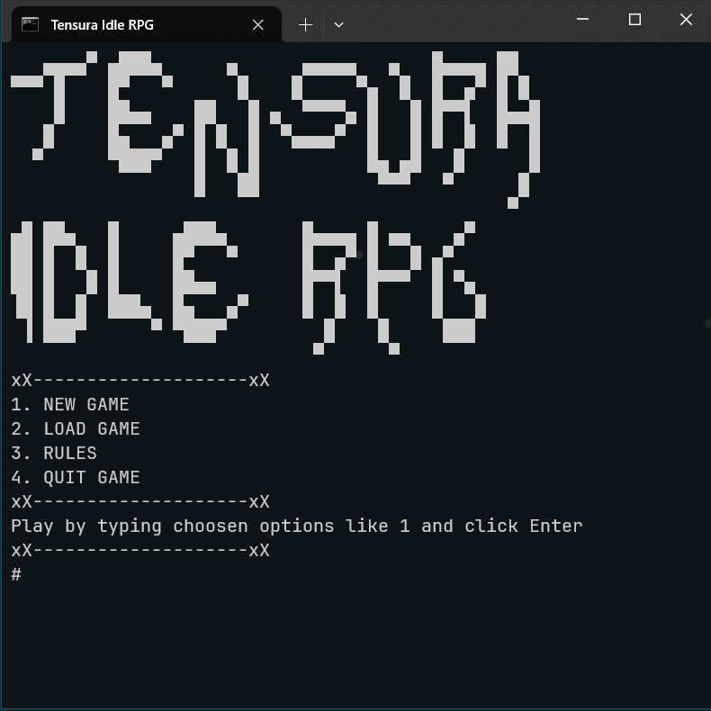

# Tensura Idle-RPG

> game theme franchise: ["That Time I Got Reincarnated as a Slime"](https://tensura.fandom.com/wiki/Tensei_Shitara_Slime_Datta_Ken_Wiki). Isekai Fantasy Adventure World with Endings.

This is ASCII CLI Text-based Adventure "Tensura Idle RPG" game.
Written in C# and .NET framework.

## Demonstration



## Features

## Release

- current: Version 1.0 Released.
- [click me to Download Game](https://github.com/dotpep/tensura-idle-rpg/releases/tag/v1.0.0)

- [About game]()
- [Rules]()

### Install Game .exe

- go to Release page on GitHub repo or [click at this release link](https://github.com/dotpep/tensura-idle-rpg/releases/tag/v1.0.0)
- download archive file PaintDrying_v1 in format .zip or .rar
- run .exe file (without deleting other files in archived file)

### How to play?

- Type options like <kbd>1</kbd>... and <kbd>Enter</kbd> to choose it.

### What's next 

> There is some list of idea

- Ability/Skills

## TODO 

- apply Clean Code and Architecture: OOP, SOLID, Patterns, ECS, MVC, Dependency Injection, State pattern
- scaling to Telegram/Discord Bots, Web, Engine, WPF
- refactoring into modular structure and OOP

### TODO: Features

- [x] Stats
- [x] Map
- [x] Movement
- [x] Enemies
- [x] Battle
- [x] Potions
- [x] Shop
- [x] NPC
- [x] Boss Fight
- [x] Add information about game and demo to README
- [ ] Release v1 game-executable to GitHub
- [ ] Auto Battle
- [ ] Refactore Harded Code
- [ ] Migrate project to .NET 7.0 version

### Requirements

- Class, Attribute, Method, Constructor, Object, Instance, Garbage Collector
- Static classes, methods, attributes and etc
- Operator Overloading
- Inheritance, base
- Encapsulation, Getter and Setters
- Polymorphism, virtual, override
- Abstract, abstract class
- Interface 

## Getting Started to Contribute

### Prerequisites

- .NET Framework 4.7.2
- Visual Studio or `dotnet` in cli

### Installation

1. Clone this repos:
```bash
git clone https://github.com/dotpep/ascii-cli-idle-rpg.git
```
2. Open project solution `project_name.sln`
3. Build and run application (CTRL + F5, in Visual Studio) or:
4. Change directory to this `cd /project_name_folder`
5. `dotnet run`

## License

This project is licensed under the [MIT License](LICENSE).
